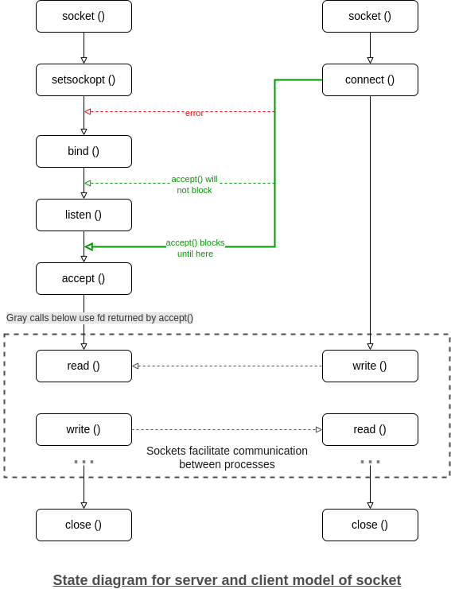

# TCP Client-Server implementation in C

TCP is suited for applications that require high reliability, and transmission time is relatively less critical.  
It is used by other protocols like HTTP, HTTPs, FTP, SMTP, Telnet. TCP does Flow Control and requires three packets 
to set up a socket connection, before any user data can be sent.

## The entire process can be broken down into following steps:



## Steps for the server:

1. Create a TCP socket
2. Bind the socket to the server address
3. Put the server socket in a passive mode, where it waits for the client to approach the server to make a connection
4. Connection is established between client and server, and they are ready to transfer data

## Steps for the client:

1. Create a TCP socket (exactly the same as that of server’s socket creation)
2. Connect newly created client socket to server

## Functions:

```
int socket(domain, type, protocol)
```
Creates an unbound socket in the specified domain.  
Returns socket file descriptor.

**Arguments:**

- domain: specifies the communication domain (AF_INET for IPv4/ AF_INET6 for IPv6)[^1]    
- type: type of socket to be created (SOCK_STREAM for TCP / SOCK_DGRAM for UDP)[^2]
- protocol: protocol to be used by the socket. 0 means use default protocol for the address family[^3]

```
int setsockopt(int sockfd, int level, int optname,  const void *optval, socklen_t optlen)
```
This helps in manipulating options for the socket referred by the file descriptor sockfd. This is completely optional, 
but it helps in reuse of address and port. Prevents error such as "address already in use".

**Arguments:**

- sockfd: socket file descriptor
- level: level for which the option is being set
- optname: name of a specified socket option[^4]
- optval: pointer to option data
- optlen: length of the option data[^5]

```
int bind (int sockfd, const struct sockaddr *addr, socklen_t addrlen)
```
Assigns address to the unbound socket.

**Arguments:**

- sockfd: socket file descriptor
- addr: structure in which address of a socket is specified[^6]
- addrlen: size of addr structure

```
int listen(int sockfd, int backlog)
```
It puts the server socket in a passive mode, where it waits for the client to approach the server to make a connection.

**Arguments:**

- sockfd: socket file descriptor
- backlog: defines the maximum length of the queue of pending connections[^7]

```
int accept(int sockfd, struct sockaddr *addr, socklen_t *addrlen)
```
It extracts the first connection request on the queue of pending connections for the listening socket, sockfd, creates a 
new connected socket, and returns a new file descriptor referring to that socket. At this point, connection is established 
between client and server, and they are ready to transfer data.

**Arguments:**

- sockfd: socket file descriptor
- addr: structure in which address of a socket is specified
- addrlen: size of addr structure

```
int connect(int sockfd, const struct sockaddr *addr, socklen_t addrlen)
```
The connect() system call connects the socket referred to by the file descriptor sockfd to the address specified by addr. 
Server’s address and port is specified in addr.

**Arguments:**

- sockfd: socket file descriptor
- addr: structure in which address of a socket is specified
- addrlen: size of addr structure

```
size_t send(int sockfd, const void *buffer, size_t length[, int flags])
```
The send() function sends data on the socket with descriptor socket. The send() call applies to all connected sockets.  
If successful, send() returns 0 or greater indicating the number of bytes sent. Otherwise, returns -1 indicating locally 
detected errors and sets errno to *ERROR_CODE*.

**Arguments:**

- sockfd: socket file descriptor
- buffer: buffer containing the message (string) to transmit
- length: length of the message pointed to by the buffer parameter ( sizeof(buffer) )
- flags: Bitwise OR of flags (optional parameter)

```
size_t read(int fd(sockfd), void *buffer, size_t length)
```
If fd refers to a socket, read() is equivalent to recv() with no flags set.

**Arguments:**

- sockfd: socket file descriptor
- buffer: pointer to the buffer that receives the data
- length: length in bytes of the buffer pointed to by the buf parameter[^8]

```
int close(int fd(sockfd))
```
Close a file descriptor.

**Arguments:**

- sockfd: socket file descriptor

[^1]: We use AF_ LOCAL as defined in the POSIX standard for communication between processes on the same host.  
      For communicating between processes on different hosts connected by IPV4, we use AF_INET and AF_I NET 6 for processes 
      connected by IPV6.

[^2]: SOCK_STREAM: TCP(reliable, connection oriented)  
      SOCK_DGRAM: UDP(unreliable, connectionless)

[^3]: This is the same number which appears on protocol field in the IP header of a packet. (man protocols for more details)

[^4]: When manipulating socket options, you must specify the level at which the option resides and the name of the option.  
      To manipulate options at the socket level, the level parameter must be set to SOL_SOCKET as defined in sys/socket.h.  
      To manipulate options at the IPv4 or IPv6 level, the level parameter must be set to IPPROTO_IP as defined in sys/socket.h 
      or IPPROTO_IPV6 as defined in netinet/in.h.  
      To manipulate options at any other level, such as the TCP level, supply the appropriate protocol number for the protocol 
      controlling the option. The getprotobyname() call can be used to return the protocol number for a named protocol.

[^5]: The optval and optlen parameters are used to pass data used by the particular set command. The optval parameter points 
      to a buffer containing the data needed by the set command. This parameter is optional and can be set to the NULL pointer, 
      if data is not needed by the command.  
      The optlen parameter must be set to the size of the data pointed to by optval.

[^6]: After creation of the socket, bind function binds the socket to the address and port number specified in 
      addr(custom data structure). In the example code, we bind the server to the localhost, hence we use INADDR_ANY 
      to specify the IP address.

[^7]: If a connection request arrives when the queue is full, the client may receive an error with an indication of ECONNREFUSED.

[^8]: The read() all applies only to connected sockets. This call returns up to N bytes of data. If there are fewer bytes 
      available than requested, the call returns the number currently available. If data is not available for the socket fs, 
      and the socket is in blocking mode, the read() call blocks the caller until data arrives. If data is not available, 
      and the socket is in nonblocking mode, read() returns a -1 and sets the error code to EWOULDBLOCK.